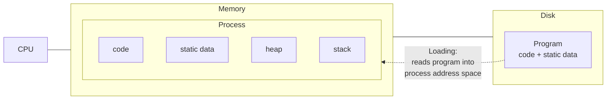
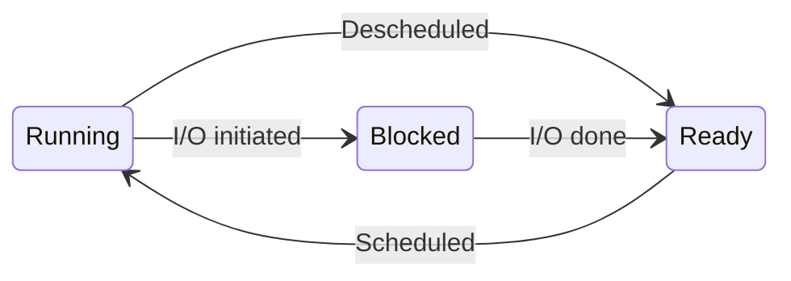

# The Abstraction - Processes
This chapter mostly talks about the process, some details of underlying machinery, it's creation and related states. A more important aspect, _**Virtualization**_ also is discussed here with a rather generic notion.

## Basic Terminology
1. **Process:** A program in action.
2. **Program:** A set of instructions to be read and executed, lying on the disk.
3. **Virtualization:** Creating an illustion of distributing a particular amongst multiple tasks.

_The illusion of multiple CPUs is accomplished via virtualization, where a particular CPU is shared by different processes, aka **Time Sharing** (in CPU context)_

For implementing virtualization, OS needs the following 2 components:
- **Mechanism**: low level machinery, i.e., actual implementation, like implementing context switches or some process specific functionality
- **Policy**: high level intelligence, i.e., policies, like scheduling policies, which program to run, which program has consumed how much memory
 
### Process API:
1. Creation:  API for creating a proc
2. Termination: API for manually terminating / killing a proc
3. Wait: can be used while graceful termination, like waiting for a process to stop on it's own.
4. Status: statistics, e.g., how long the proc has been running, memory / CPU consumed, etc.
5. Misc. : things like pausing and resuming a proc

### Process Creation
1. As stated before, a process is a program in action. In order to run (execute) a program, the OS first needs to know the code to run.
2. This code is present in an executable format and program metadata resides on disk, which OS loads into memory for execution.
3. Modern OSes load program lazily, i.e., loading pieces of data / code when they are needed during program execution.
4. OS allocates some memory for program's _(runtime) stack_. This stack comprises static data, like fields, arguments, return address, etc.
5. It furthermore allocates the memory to be used during program execution, known as _heap memory_. This is dynamic and grows as per instructions in the program(given be developer). (like `malloc` in C)
6. Now OS executes the program by invoking it's `main()` (entrypoint) routine, thereby starting a process.

### Process States
- Ready
    - The process is ready to be in executed state.
    - But not being executed because of some decision that OS has made for it at the moment.
- Running
    - Running on the processor
    - Executing it's instructions
- Blocked: 
    - The process has performed some operation which makes it _not_ ready to run until some other event takes place.
    - e.g., it has hit some kind of IO operation

Following are the process state transistions:

### Additional Reading
- Processes - [link](https://www.cs.uic.edu/~jbell/CourseNotes/OperatingSystems/3_Processes.html)
